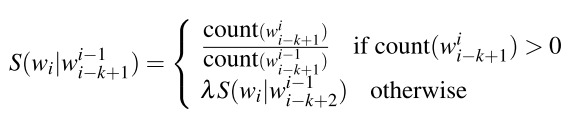
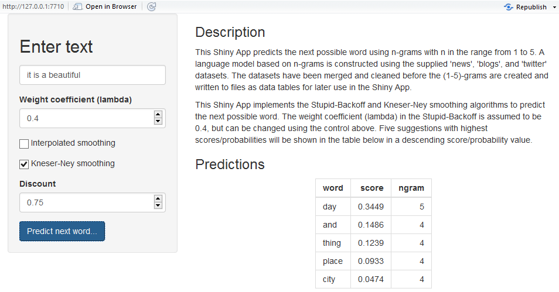

<!-- Center image on slide -->

## A Brief Description

- A n-gram language model is developed for next word prediction which is purposed to be used as a smart keyboard input for mobile devices.

- A large corpus of text documents (news, blogs, twitts) is analyzed to discover the structure in the data  to support the construction of the model. The R packages used for preliminary text processing include: _tm_, _quanteda_, _data.table_, etc.

- The techniques of text mining and natural language processing, e.g. Stupid Backoff and Interpolated Kneser-Ney smoothing algorithms, are employed.

- The model is implemented in a Shiny App that allows online interactive next word prediction.

--- .class #id 

## Preliminary Data Processing

- The *news*, *blogs*, and *twitts* databases are found to contain huge numbers of text lines (1,010,242, 899,288,
and 2,360,148, respectively), which include words, numbers, symbols, emoticons, etc. The *twitts* data are particularly rich in symbols, special characters, and emoticons, which need to be removed during the preliminary data processing

- R packages *tm* and *quanteda* are used to:
    + break the text lines into sentences
    + clean the text corpus of numbers, symbols, emoticons, puntuations, URLs, etc.
    + tokenize the text and construct of n-gram (n from 1 to 5) data tables
    
- All the corpus of text data is processed part by part. The created n-grams are pruned (removing any n-gram with a count less than 4) and written to files for later use in the Shiny App

---

## N-grams For Next-Word Prediction

n-gram     |    number of n-grams
---------- | ---------------------
1          | 109,769
2          | 787,960
3          | 836,358
4          | 361,461
5          | 100,047

The n-grams are tokenized and stored as data tables (R data.table) to facilitate faster search and manipulation

---

## Next Word Prediction Model

- Stupid Backoff is easy to be implemented and suitable for large-scale language models - if a higher-order n-gram search results in zero count, the search is simply backoffed to a lower order n-gram. A score together with a weight ($\lambda$ , depending on the n-gram order) is used instead of probability in the search for the next word

- Kneser-Ney algorithm is one of the most commonly used and best performing n-gram smoothing methods. Kneser-Ney algorithm allows the use of *context* in defining the most probable next work. Kneser-Ney algorithm is slower than Stupid Backoff as recursive calculation over n-grams of different orders is required

---

## Shiny App

- The model is implemented in a Shiny App that allows interactive next word search

- ui.R realizes an user interface with input/output, controls, and description, including
    * A text box for text input by the user 
    * A table displaying the results of next word predictions with score/probability and used n-gram(s)

- server.R contains the code which performs the following tasks
    * Reading in n-gram data table from files
    * Processing text input by the user
    * Conducting search and computation of score or probability of possible next word candidates

---

## Screen Capture of the Shiny App Run

